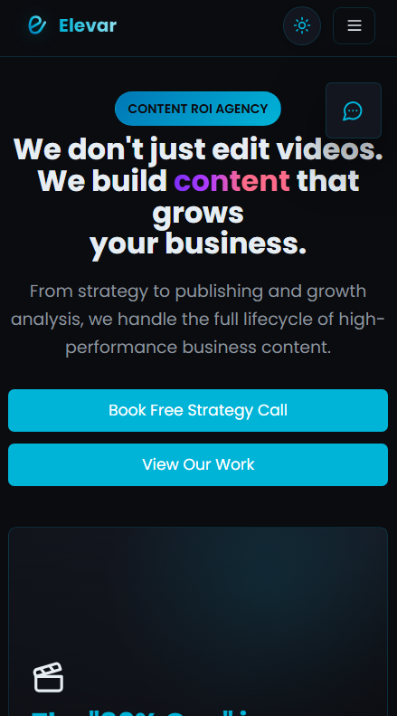
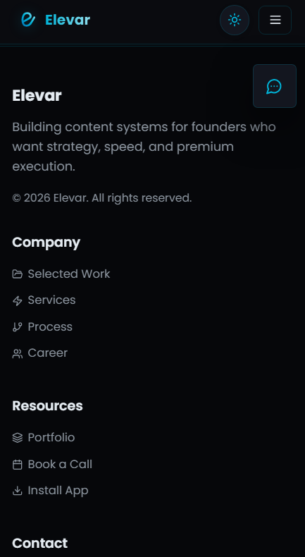

<p align="center">
  
</p>

<h1 align="center">Elevar 🚀</h1>

<p align="center">
  <strong>Strategic content engines for personal brand growth &amp; elevation.</strong><br />
  We don't just edit videos — we build content that grows your business.
</p>

<p align="center">
  
  
  
  
  
</p>

---

## ✨ What it is

**Elevar** is a sleek, dark-first marketing site for a content ROI agency. From strategy to publishing and growth analysis, it handles the full lifecycle of high-performance business content — wrapped in a fast, animated, conversion-focused UI.

> Content ROI Agency · Full-funnel content systems for founders &amp; personal brands.

## 🖼️ UI Preview

<table>
  <tr>
    <td align="center"><strong>Desktop</strong></td>
    <td align="center"><strong>Mobile</strong></td>
  </tr>
  <tr>
    <td></td>
    <td></td>
  </tr>
  <tr>
    <td colspan="2" align="center"></td>
  </tr>
</table>

## 🧩 Key Sections

- **Hero** — animated 3D scene (`react-three-fiber` / `three`) with a scroll-stopping value prop and dual CTAs.
- **Process** — an 8-step engine: Discovery → Strategy → Script → Pre-Prod → Production → Post → Publishing → Growth Analysis.
- **Services** — Video Editing, Content Strategy, AI Production, Social Management, Brand Content, and a Custom Bundle.
- **Portfolio** — vertical 9:16 reels showcasing real work.
- **About / Founder** — brand story with founder imagery.
- **Book a Call** — discovery-call capture flow.
- **Chat Support** — a lightweight conversational helper that routes visitors to the right next step.
- **Career** — open roles page.

## 🎨 Design Highlights

- 🌗 **Light / Dark mode** with a persistent theme toggle (stored in `localStorage`).
- 🌀 **3D hero** powered by Three.js for an immersive first impression.
- 🎞️ **Framer Motion** micro-interactions and scroll reveals.
- 🧱 **Tailwind CSS** design system with CSS variables for surfaces, borders, and shadows.
- 📱 Fully **responsive** — looks sharp from phone to widescreen.
- 💬 Floating **chatbot button** for instant guidance.

## 🛠️ Tech Stack

| Layer | Tools |
|-------|-------|
| Framework | Next.js 14 (App Router, static export) |
| UI | React 18, Tailwind CSS, Radix UI primitives |
| Motion | Framer Motion |
| 3D | Three.js, `@react-three/fiber`, `@react-three/drei` |
| Icons | lucide-react |
| Forms | Career → mailto; Book-a-Call → embedded Google Form |
| Deploy | GitHub Pages (`/elevar` base path) |

## 🚀 Getting Started

```bash
# install dependencies
bun install        # or: npm install

# run the dev server
bun run dev        # http://localhost:3000

# build for production (static export to /out)
bun run build

# preview the production build
bun run start
```

> 💡 Environment variables are documented in `.env.example` / `.env.local.example`.

## 📁 Project Structure

```
app/
  page.tsx              # home (hero, process, services, portfolio, about)
  chat/                 # conversational support page
  book-call/            # discovery call capture
  career/               # open roles
  selected-work/        # portfolio detail
  components/           # Navigation, Footer, HeroScene, ChatbotButton, ...
components/ui/          # shared UI primitives
public/                 # logo, founder image, portfolio videos
docs/screenshots/       # UI previews
```

## 🌍 Deployment

The site is exported statically and served from **GitHub Pages** under the `/elevar` path. Production builds set `basePath` / `assetPrefix` automatically via `next.config.mjs`.

---

<p align="center">
  Made with ☕ &amp; a lot of <strong>content strategy</strong> by the Elevar team.
</p>
