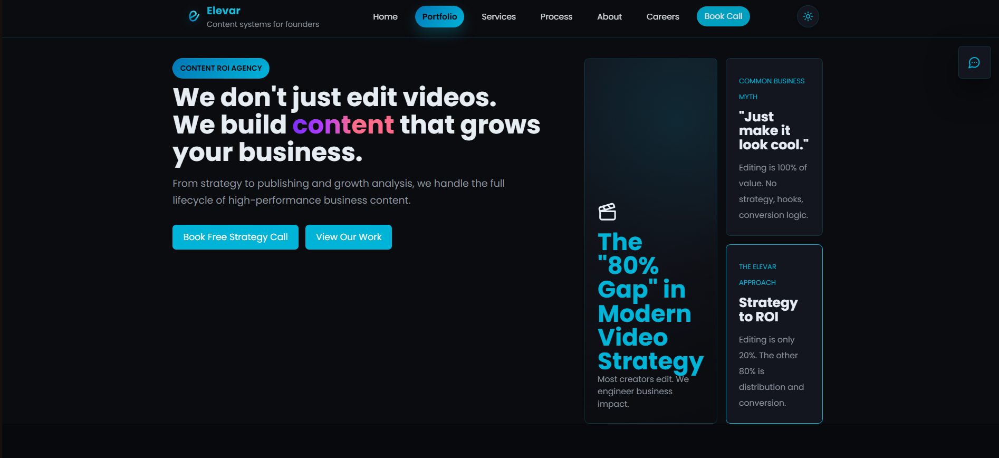

# 🚀 Elevar

<p align="center">
  
</p>

<p align="center">
  <strong>Content systems for founders.</strong><br>
  We don't just edit videos. We build content that grows your business.
</p>

<p align="center">
  <a href="https://nextjs.org/">
    
  </a>
  <a href="https://www.typescriptlang.org/">
    
  </a>
  <a href="https://react.dev/">
    
  </a>
  <a href="https://git-lfs.github.com/">
    
  </a>
</p>

--- 

## 🖥️ Website Preview

### Desktop

<p align="center">
  
</p>

### Mobile

<p align="center">
  
</p>

---

# 📖 About

**Elevar** is a premium content agency website built with **Next.js 15** and **TypeScript**.
**Visit Our Page**
<a href="https://elevar-digital-studio.vercel.app/">
  Elevar
</a>

The website represents a modern content agency that helps founders build authority through cinematic storytelling, strategic content systems, AI-powered production, and performance-driven growth.

Rather than simply showcasing services, Elevar is designed as a high-converting landing page that communicates trust, premium quality, and measurable business outcomes.

---

# ✨ Features

- 🎨 Modern premium UI
- ⚡ Built with Next.js 15 App Router
- 📱 Fully responsive design
- 🎬 Portfolio showcase
- 📈 Growth-focused landing page
- 📅 Book Call CTA
- 🌙 Clean typography & animations
- 🧩 Modular React components
- 🚀 Optimized performance
- 🔍 SEO friendly

---

# 🎯 Mission

> Helping founders break scale with premium strategy, cinematic storytelling, and efficient content systems.

---

# 💡 Philosophy

We don't just create beautiful content.

We engineer content systems that generate:

- Authority
- Trust
- Reach
- Leads
- Revenue

Everything—from scripting to publishing—is designed around business growth.

---

# 📊 Current Stats

| Metric | Value |
|---------|------:|
| Brands Scaled | **2+** |
| Total Views | **35K+** |
| Founder | **Karthikeyan K** |

---

# 🛠 Services

| Service | Description |
|----------|-------------|
| 🎬 Video Editing | Retention-focused editing designed for modern attention spans |
| 📈 Content Strategy | Growth roadmaps built around authority and positioning |
| 🤖 AI Production | AI-assisted ideation, scripting, research, and workflows |
| 📱 Social Media Management | Publishing, scheduling, and platform optimization |
| 🎯 Brand Content | Content designed to convert viewers into customers |
| 📦 Custom Bundle | Tailored content systems for unique business goals |

---

# 🔄 Workflow

Elevar follows an 8-step production pipeline.

| Step | Process |
|------|----------|
| 01 | Business Discovery |
| 02 | Strategy |
| 03 | Script Writing |
| 04 | Pre-Production |
| 05 | Production |
| 06 | Post Production |
| 07 | Publishing |
| 08 | Growth Analysis |

---

# 🖥 Tech Stack

| Technology | Usage |
|------------|------|
| Next.js 15 | React Framework |
| React 18 | UI Library |
| TypeScript | Type Safety |
| CSS | Styling |
| Git LFS | Video Asset Storage |

---

# 📂 Project Structure

```
Elevar
│
├── app/
│   ├── layout.tsx
│   ├── page.tsx
│   ├── globals.css
│   └── components/
│       ├── Navigation.tsx
│       ├── Hero.tsx
│       ├── Services.tsx
│       ├── Process.tsx
│       ├── Testimonials.tsx
│       ├── Footer.tsx
│       └── ChatbotButton.tsx
│
├── assets/
│   └── selected-work/
│       ├── Family friend_Out.mp4
│       ├── Final Out Tiles.mp4
│       └── NanoTiles-.mp4
│
├── public/
│   ├── favicon.ico
│   └── images/
│
├── next.config.mjs
├── tsconfig.json
├── package.json
├── package-lock.json
├── .gitignore
└── README.md
```

---

# 🎨 Brand Identity

## Colors

| Color | Hex |
|--------|-----|
| Primary | `#1A1A1A` |
| Accent | `#C9A84C` |
| Background | `#FFFFFF` |

---

## Typography

- **Headings:** Inter
- **Body:** Inter
- **Fallback:** System Fonts

---

## Brand Tagline

> **Content systems for founders.**

---

# 🚀 Getting Started

## Prerequisites

Install:

- Node.js 18+
- npm

or

- pnpm

or

- yarn

---

## Clone Repository

```bash
git clone https://github.com/nameisvignesh/Elevar.git

cd Elevar
```

---

## Install Dependencies

Using npm

```bash
npm install
```

Using Yarn

```bash
yarn
```

Using pnpm

```bash
pnpm install
```

---

## Start Development Server

```bash
npm run dev
```

or

```bash
yarn dev
```

or

```bash
pnpm dev
```

Visit:

```
http://localhost:3000
```

---

# 🏗 Production Build

Create production build

```bash
npm run build
```

Run production server

```bash
npm start
```

---

# 🎬 Managing Video Assets

Elevar stores video files using **Git LFS**.

Track videos:

```bash
git lfs track "*.mp4"

git lfs track "*.mov"
```

Commit

```bash
git add .

git commit -m "Add new video assets"

git push origin main
```

> **Current LFS Usage**
>
> Storage Used: **~778 MB**
>
> Free Tier Limit: **1 GB**

---

# 📈 Performance

| Metric | Status |
|--------|--------|
| SEO | ✅ Optimized |
| Accessibility | ✅ Good |
| Responsive | ✅ Mobile Friendly |
| Core Web Vitals | ✅ Passing |
| Performance | ✅ Fast |
| Best Practices | ✅ Modern |

---

# 📸 Website Sections

- Hero
- Selected Work
- Services
- Process
- Testimonials
- FAQ
- Contact
- Footer

---

# 📦 Scripts

| Command | Description |
|---------|-------------|
| `npm run dev` | Development server |
| `npm run build` | Production build |
| `npm start` | Start production server |
| `npm run lint` | Run ESLint |

---

# 🌟 Future Improvements

- CMS Integration
- Blog
- Dark/Light Theme
- Analytics Dashboard
- AI Chat Assistant
- Case Studies
- Multi-language Support
- Client Portal
- Booking System
- Newsletter Integration

---

# 👨‍💻 Founder

**Karthikeyan K**

Founder & CEO

Elevar

---

# 🤝 Contributing

Contributions are welcome.

1. Fork the repository

2. Create your feature branch

```bash
git checkout -b feature/NewFeature
```

3. Commit your changes

```bash
git commit -m "Add new feature"
```

4. Push the branch

```bash
git push origin feature/NewFeature
```

5. Open a Pull Request

---

# 📄 License

This project is licensed under the **Apache-2.0 License**.

Feel free to use, modify, and distribute this project under the terms of the license.

---

# ⭐ Support

If you like this project, consider giving it a ⭐ on GitHub.

It helps others discover the project and supports future development.

---

<p align="center">
Made with ❤️ using Next.js, React & TypeScript
</p>

<p align="center">
<b>Elevar — Content systems for founders.</b>
</p>
